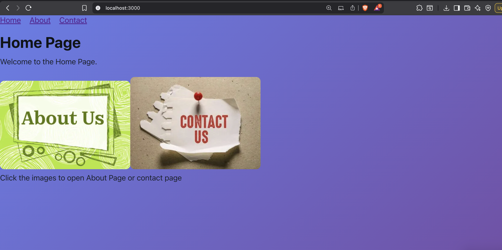
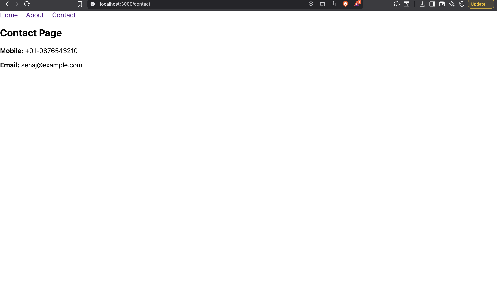
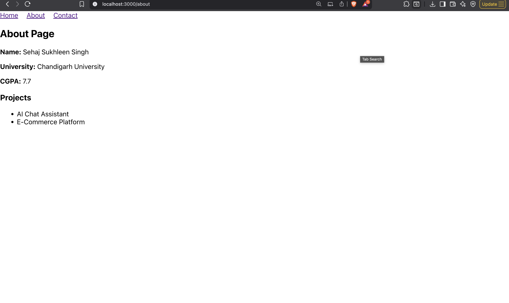

# EXP3 - React Router Navigation App

A React web application built with React Router for multi-page navigation. This project demonstrates routing between Home, About, and Contact pages with image-based navigation.

**Author:** Sehaj Sukhleen Singh  
**University:** Chandigarh University  
**CGPA:** 7.7

## Project Overview

This application showcases:
- React Router DOM for client-side routing
- Multi-page navigation (Home, About, Contact)
- Image-based navigation between pages
- Interactive component rendering based on routes

## Available Scripts

In the project directory, you can run:

### `npm start`

Runs the app in the development mode.\
Open [http://localhost:3000](http://localhost:3000) to view it in your browser.

The page will reload when you make changes.\
You may also see any lint errors in the console.

### Screenshot 1

### Screenshot 2

### Screenshot 3

